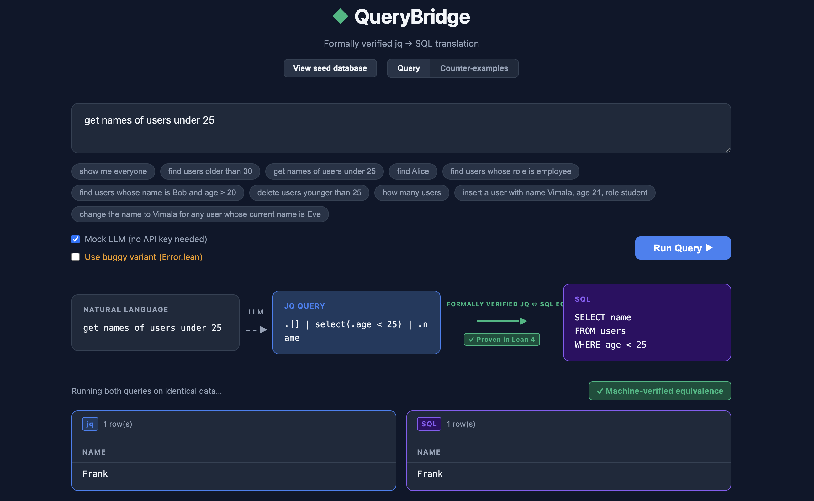
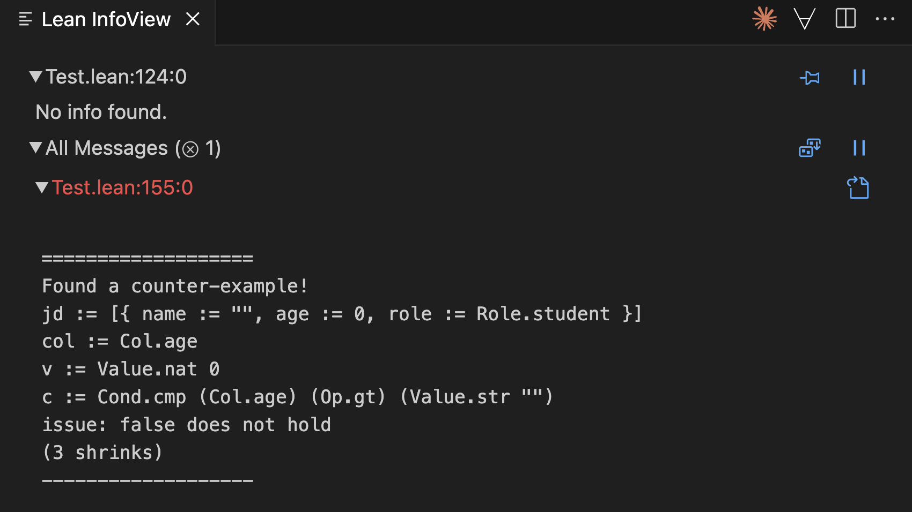

# QueryBridge

**jq → SQL**, with a machine-checked proof that the two queries always return the same results.

## Project Description

QueryBridge allows users to write queries in plain English. A model converts it into a **jq** (for JSON data), and our system then translates that **jq** into an equivalent **SQL** query (for relational databases). This is useful because JSON works well for flexible, nested data, while SQL is better for fast queries and handling large datasets, so converting between them gives both flexibility and performance.

The core goal of the project is **correctness**. We use **Lean 4** to formally verify that the generated SQL query has the same meaning as the original jq.

To achieve this, we:
- Model JSON and SQL databases as separate data structures
    - JDB is the usual list of JSON records, each holding a complete user.
    - SDB uses a columnar format, separate lists per field for efficient column-wise scans and aggregates.
- Define when these databases are **equivalent**  
- Design small query languages for jq and SQL  
- Implement a translation from jq queries to SQL  
- Use **Plausible** for property-based testing — when a property cannot be proven, Plausible automatically searches for a counterexample that exposes the bug.

### Key Result

If the JSON and SQL databases start out equivalent, then running a jq query on the JSON database and its translated SQL query on the SQL database will produce **equivalent results**.

## How the proof reaches the running app

The Lean proof isn't a side document — the backend actually executes it. A small Lean binary (`jqGenMain`) parses the jq string into the verified `JQuery` AST. The proven-correct `jquery_to_squery` then converts the `JQuery` into an `SQuery`, and a second binary (`sqlGenMain`) templatizes that `SQuery` value into an executable SQL string. The result shows up in the UI as **"SQL (Lean-derived)"** alongside the unverified `translator.py` output. Both queries run on identical seed data; the proof rules out any case where the two result panels could disagree. For example, the end-to-end flow is shown in the GUI screenshot below.


### Counter-example generation using Plausible

We use Plausible to write property-based tests that automatically search for counterexamples. To showcase this, `ProofPilot/Error.lean` is a near-duplicate of `Main.lean` seeded with four deliberate bugs — for instance, `eval_jquery JQuery.modify` always returns `[]` regardless of the database. The `prop_modify_preserves_count` test in `Tests.lean` checks that a `modify` query never changes the row count (since modify only rewrites fields, never adds or removes users). Plausible fails to prove this property and generates a counterexample like the one below: a database with a single user where, due to the bug, the length after `modify` is `0` instead of `1`. 



## Supported Queries

- `SELECT *` — `.[]`
- `SELECT * WHERE …` — `.[] | select(.field op value)`
- `SELECT col FROM … WHERE …` — `.[] | select(.field op value) | .col`
- `DELETE WHERE …` — `del(.[] | select(.field op value))`
- `COUNT(*)` — `length`
- `INSERT INTO … VALUES …` — `.[] | insert("name", age, "role")`
- `UPDATE … SET col = v WHERE …` — `.[] | update(.col, value, <predicate>)`

Predicates may combine leaf comparisons with `&&` (AND) or `||` (OR).

Operators: `==`, `>`, `>=`, `<`, `<=`.

## Run

### Docker (one command, everything inside)

```bash
docker build -t querybridge .
docker run --rm -p 8000:8000 querybridge
# open http://localhost:8000
```

The image is multi-stage: it builds the React bundle, fetches Mathlib's prebuilt oleans and compiles the four Lean executables, then assembles a slim Python runtime that serves the API and the SPA on a single port. Set `ANTHROPIC_API_KEY` via `-e` to use the real LLM in place of the mock.

### Local — three steps

We provide a `setup.sh` script that automates the entire flow — installing the backend dependencies, starting the backend, installing the frontend dependencies, launching the dev server, and opening the QueryBridge UI in your browser:

```bash
./setup.sh
```

If you'd rather run the steps manually, follow the three sections below.

#### Lean binaries (one-time, ~30s on warm cache)
```bash
cd ProofPilot
lake update                              # one-time Mathlib fetch
lake build sqlGenMain sqlGenError sqlGenBug2 sqlGenBug3
```
Pass the explicit targets — a bare `lake build` pulls in `Test.lean`, which intentionally fails because Plausible finds the count counter-example in `Error.lean`.

If the binaries aren't built the rest of the app still works; the Lean-derived SQL box just shows a build hint instead.

#### Backend
```bash
cd backend
pip install -r requirements.txt
uvicorn main:app --port 8000 --reload
```

#### Frontend (separate terminal)
```bash
cd frontend
npm install
npm run dev
# → http://localhost:5173
```

The UI has a **Mock LLM** toggle (on by default) — no API key needed to try it. To use the real Claude API, copy `backend/.env.example` to `backend/.env` and set `ANTHROPIC_API_KEY`.

## Origin

This project was built during the **LeanLang for Verified Autonomy Hackathon** (April 17–18 + online through May 1, 2026) at the **Indian Institute of Science (IISc), Bangalore**.
Sponsored by **[Emergence AI](https://www.emergence.ai)**.
Organized by **[Emergence India Labs](https://east.emergence.ai)** in collaboration with **IISc Bangalore**.

## Acknowledgments

This project was made possible by:
- **Emergence AI** — Hackathon sponsor
- **Emergence India Labs** — Event organizer and research direction
- **Indian Institute of Science (IISc), Bangalore** — Academic partner, hackathon co-design, tutorials, and mentorship

## Links

- [Hackathon Page](https://east.emergence.ai/hackathon-april2026.html)
- [Emergence India Labs](https://east.emergence.ai)
- [Emergence AI](https://www.emergence.ai)
