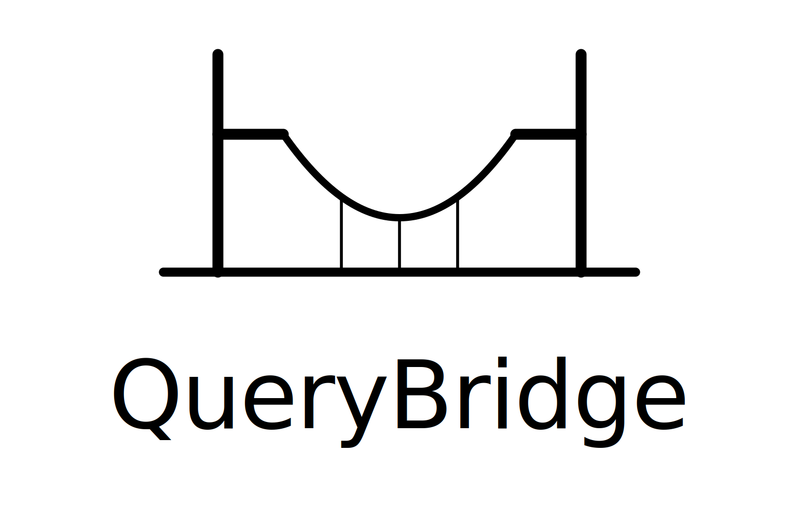
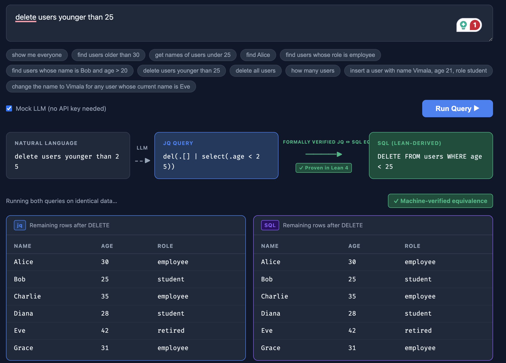
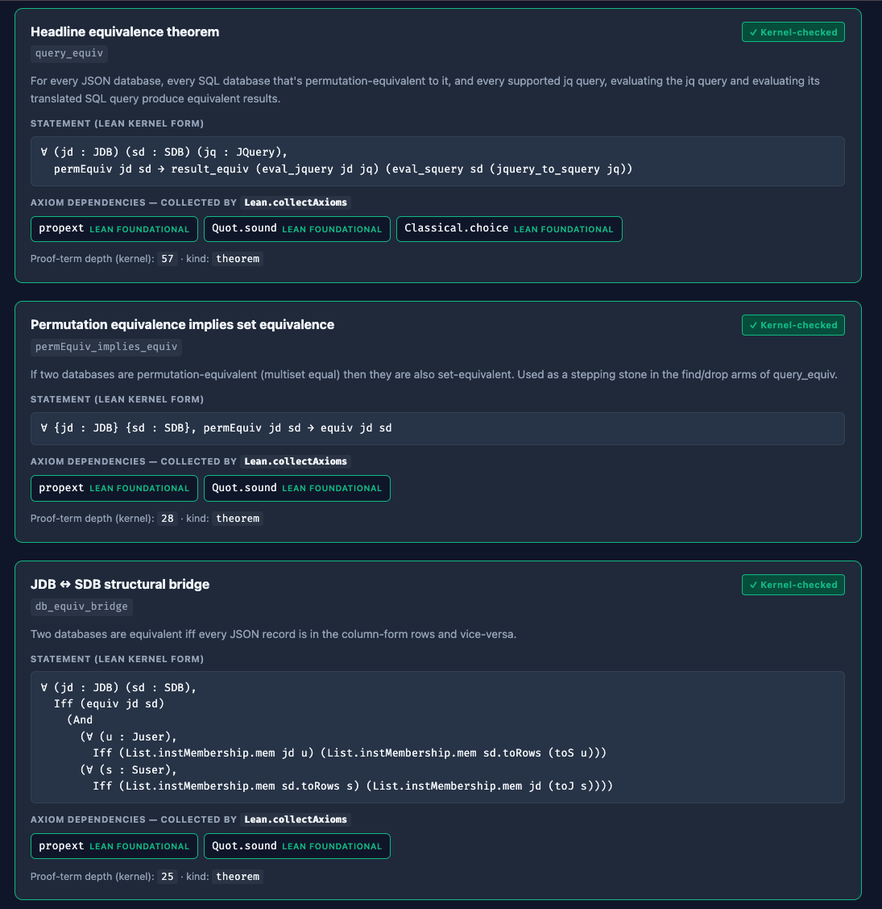
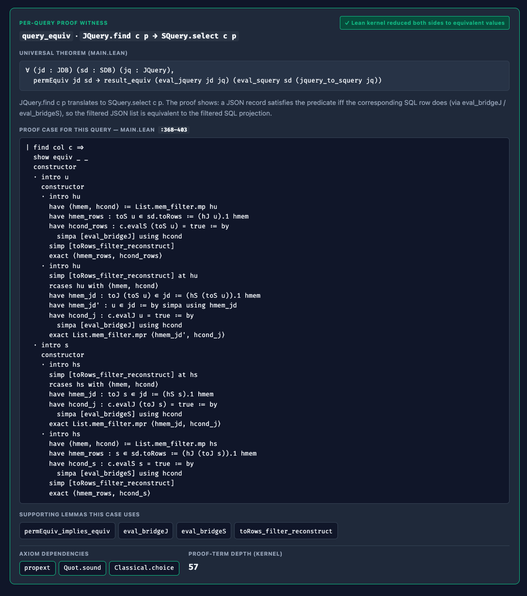
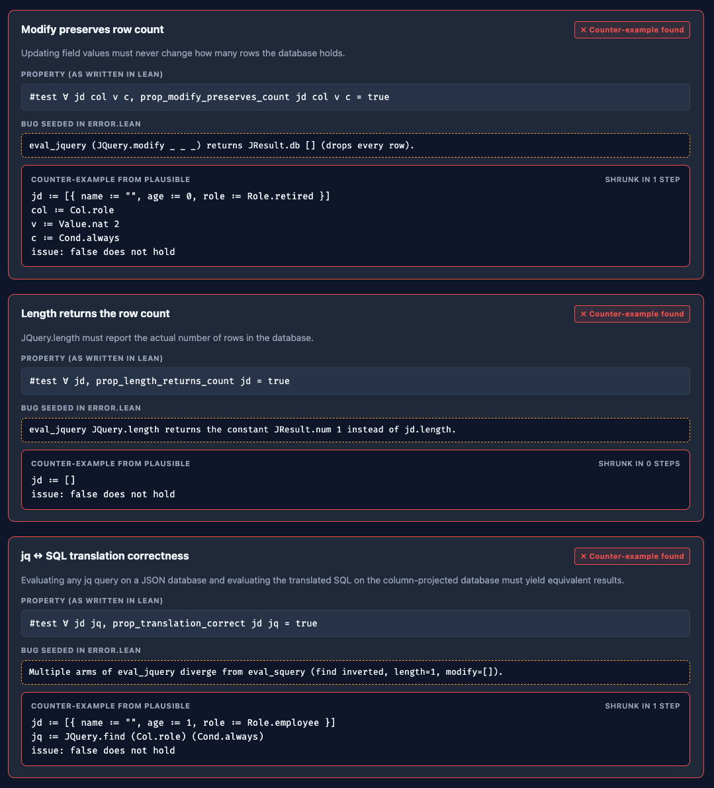
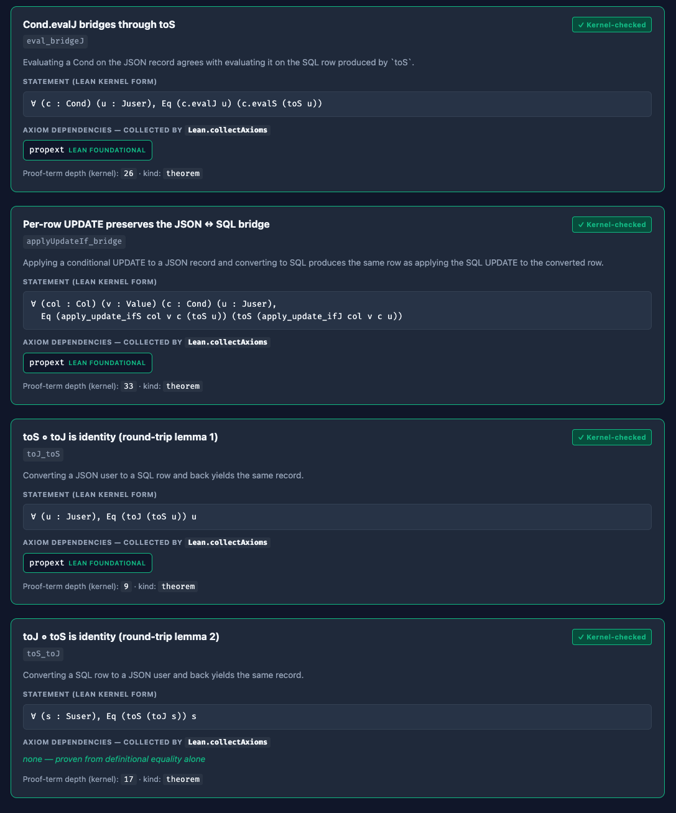

<p align="center">
  
</p>

# QueryBridge

**Verified jq → SQL translation, kernel-checked in Lean 4.**

Type a query in plain English. A model produces a [jq](https://jqlang.org/)
expression over the JSON view of the data; the verified Lean binary
translates that jq into the equivalent SQL over the relational/columnar
view; the SQL runs on the seed data and the answer is shown alongside the
proof witness for *that specific query*. The translation is **proven
correct in Lean 4** — every theorem behind it is kernel-checked, and every
property the proof should rule out is randomly stress-tested by
[Plausible](https://github.com/leanprover-community/plausible).

---

## Why this exists — data lakes need a verified bridge

Modern data-lake architectures keep two views of the same data:

- **JSON / document layer** — flexible nested records. Cheap to evolve. The
  natural query language is jq.
- **Parquet / columnar layer** — column-pruning, vectorised scans, and
  predicate push-down make analytical queries orders of magnitude faster.
  The natural query language is SQL.

Engineers routinely write the same logical query in both layers — a jq
filter for an ad-hoc inspection, a SQL aggregate for the dashboard — and the
two had better agree. *Silently divergent* translations are the worst kind of
bug because both sides "look right" on small inputs and only disagree on the
edge cases that drive the production decision.

QueryBridge attacks this with a mechanically-checked correspondence:

> **Theorem `query_equiv`.** For every JSON database `jd`, every SQL database
> `sd` that is permutation-equivalent to it, and every supported jq query
> `jq`: evaluating `jq` against `jd` and evaluating `jquery_to_squery jq`
> against `sd` produce equivalent results.

The proof is mechanized in Lean 4 in `ProofPilot/Main.lean`, and the same translation function (`jquery_to_squery`) the proof reasons about is the one shipped in the binary — so the guarantee bears on every query the user runs.

---

## End-to-end demo



A typical run:

1. The user types *"delete users younger than 25"*.
2. The mock LLM (or, with `ANTHROPIC_API_KEY` set, the live model) emits the
   jq expression `del(.[] | select(.age < 25))`.
3. The Lean binary `ProofPilot/jqGenMain` parses the *same* jq into the
   verified `JQuery` AST. The proven-correct `jquery_to_squery` in
   `ProofPilot/Main` converts the `JQuery` into an `SQuery`, and a second
   binary (`ProofPilot/sqlGenMain`) templatizes that value into an executable
   SQL string. The UI shows both translations side-by-side, with the
   Lean-derived one tagged `✓ Proven in Lean 4`.
4. Both queries run against identical seed data, and the result panels show
   the surviving rows on each side. The proof rules out any case where the
   two panels could disagree.

The end-to-end flow is shown in the GUI screenshot above.

---

## Architecture

The system has three layers (Lean / Python / React). Each is summarised
on its own first; the integrated end-to-end picture follows.

### Lean layer — what becomes a binary, and from what

```
                         ProofPilot/   (Lean 4 — kernel-checked at `lake build`)

   ════════════ VERIFIED PATH ════════════         ════════ PROPERTY-TEST PATH ═══════

   ┌──────────────────────────────────┐            ┌──────────────────────────────────┐
   │           Main.lean              │            │           Error.lean             │
   │   • JDB / SDB models             │            │   Near-duplicate of Main.lean    │
   │   • JQuery / SQuery types        │            │   with three seeded bugs in      │
   │   • eval_jquery / eval_squery    │            │   eval_jquery:                   │
   │   • jquery_to_squery   (PROVEN)  │            │   • find: predicate inverted     │
   │   • query_equiv        (THEOREM) │            │   • length: returns the const 1  │
   │   • six supporting lemmas        │            │   • modify: returns []           │
   └──────┬─────────────────┬─────────┘            └─────────────┬────────────────────┘
          │ import          │ import                             │ import
          ▼                 ▼                                    ▼
   ┌──────────────┐   ┌──────────────────┐           ┌──────────────────────────┐
   │ JqGenMain    │   │  ProofTrace.lean │           │     Properties.lean      │
   │ .lean        │   │  • Lean.import-  │           │  • Arbitrary instances   │
   │  jqToJQuery  │   │    Modules       │           │    for JDB, JQuery, …    │
   │  parses jq   │   │  • Meta.ppExpr   │           │  • prop_modify_…count    │
   │  string into │   │  • Lean.collect  │           │  • prop_length_returns…  │
   │  JQuery AST  │   │    Axioms        │           │  • prop_translation_…    │
   └──────┬───────┘   └────────┬─────────┘           │  • prop_find_always_…    │
          │ import             │                      └──────────────┬───────────┘
          ▼                    │                                     │ import
   ┌──────────────┐            │                                     ▼
   │ SqlGenMain   │            │                            ┌──────────────────┐
   │ .lean        │            │                            │ PropRunner.lean  │
   │  main : IO   │            │                            │  for each prop:  │
   │  • parse jq  │            │                            │   Plausible.     │
   │  • apply     │            │                            │   Testable.      │
   │   jquery_to_ │            │                            │   checkIO        │
   │   squery     │            │                            │  → TestResult    │
   │  • eval both │            │                            │  emit JSON array │
   │   sides on   │            │                            │  main : IO       │
   │   seedDB     │            │                            └────────┬─────────┘
   │  • emit JSON │            │                                     │
   └──────┬───────┘            │ lake build                          │ lake build
          │                    ▼                                     ▼
          │ lake build   ┌──────────────────┐                  ┌──────────────────┐
          ▼              │   proofTrace     │                  │   propRunner     │
   ┌──────────────┐      │   (~155 MB exe;  │                  │   (~155 MB exe;  │
   │  sqlGenMain  │      │   runs once at   │                  │   spawned every  │
   │  (~155 MB,   │      │   build time;    │                  │   /api/properties│
   │  spawned per │      │   output cached  │                  │   request)       │
   │  /api/query) │      │   as proof_      │                  └──────────────────┘
   └──────────────┘      │   trace.json)    │
                         └──────────────────┘
```

### Python layer — three endpoints, one FastAPI app

```
                                backend/   (FastAPI on uvicorn)

      POST /api/query                GET /api/properties           GET /api/proofs
            │                                │                            │
            ▼                                ▼                            ▼
        run_query()                    properties()                   proofs()
         (main.py)                      (main.py)                    (main.py)
            │                                │                            │
            ├─ llm_client.nl_to_jq           │                            │
            │   (Anthropic SDK or            │                            │
            │    keyword-rule mock)          │                            │
            │                                │                            │
            ├─ translator.translate          │                            │
            │   (Python jq→SQL fallback,     │                            │
            │    used when no Lean binary)   │                            │
            │                                │                            │
            ├─ executor.run_jq(USERS)        │                            │
            │   in-memory eval over          │                            │
            │   seed_data.USERS              │                            │
            │                                │                            │
            ├─ executor.run_sql(sql)         │                            │
            │   feeds the SQL string to      │                            │
            │   sqlite3 (in-process, in-mem) │                            │
            │                                │                            │
            ├─ lean_client.run_lean(jq)      │                            │
            │   subprocess.run([sqlGenMain]) │                            │
            │                                │                            │
            ├─ proof_witness.build_witness   │                            │
            │   • reads ProofPilot/Main.lean │                            │
            │     to extract the proof case  │                            │
            │     source span (lines 368-528)│                            │
            │   • merges axiom info from     │                            │
            │     ProofPilot/proof_trace.json│                            │
            │                                │                            │
            ▼                                ▼                            ▼
                              counterexample_runner.py
                              ├ collect_counterexamples()         ├ collect_proof_traces()
                              │   subprocess.run([propRunner])    │   read proof_trace.json
                              │                                   │   (cached snapshot)
                              ▼                                   ▼
                          JSON: 4 property results            JSON: 7 verified theorems
                          with counter-examples               with axiom dependencies
```

### Frontend layer — three tabs, shared support

```
                          frontend/src/   (Vite + React + TypeScript)

                                 App.tsx
                       (top-level state, three tabs)
                                    │
              ┌─────────────────────┼─────────────────────────┐
              │                     │                         │
        view='query'           view='proofs'           view='properties'
              │                     │                         │
              ▼                     ▼                         ▼
      ┌──────────────┐      ┌──────────────┐         ┌──────────────────┐
      │ QueryInput   │      │ ProofResults │         │ PropertyResults  │
      │   .tsx       │      │   .tsx       │         │   .tsx           │
      │ • textarea   │      │ • fetches    │         │ • fetches        │
      │ • examples   │      │   /api/proofs│         │   /api/properties│
      │ • mock       │      │ • renders 7  │         │ • renders 4      │
      │   toggle     │      │   theorems   │         │   property cards │
      └──────┬───────┘      │ • axiom chips│         │ • shrunk counter-│
             │              └──────────────┘         │   example block  │
             │ onRun(query)                          └──────────────────┘
             ▼
     api.ts: runQuery()  ─── POST /api/query ───▶  (backend)
                                                          │
                                                          ▼  result
             ┌────────────────────────────────────────────┘
             │
             ▼  rendered as three stacked sections in the Query view:
       ┌────────────────────┐
       │   Pipeline.tsx     │  NL ──LLM──▶ jq ──Formally verified──▶ SQL
       ├────────────────────┤  (Lean-derived)
       │  SplitResults.tsx  │  table of returned rows
       ├────────────────────┤
       │ ProofWitnessPanel  │  per-query proof witness:
       │   .tsx             │  • case (find/drop/clear/length/…)
       │                    │  • case_source from Main.lean
       │                    │  • axiom chips
       │                    │  • kernel_match: true
       └────────────────────┘

                          shared support modules
                          ├ types.ts          TypeScript shapes for all responses
                          ├ api.ts            typed fetch wrappers
                          └ DatabaseViewer    modal showing the seed users
```

### End-to-end — how the three layers talk

```
   ┌── BROWSER ────────────────────────────────────────────────────────────────────┐
   │                                                                                │
   │  React SPA  (served by FastAPI as static assets at /)                          │
   │                                                                                │
   │     Query tab        Proofs tab          Property tests tab                    │
   │       │                  │                       │                              │
   └───────┼──────────────────┼───────────────────────┼──────────────────────────────┘
           │                  │                       │
   POST /api/query    GET /api/proofs        GET /api/properties
           │                  │                       │
           ▼                  ▼                       ▼
   ┌── PYTHON BACKEND  (FastAPI / uvicorn) ────────────────────────────────────────┐
   │                                                                                │
   │  main.py routes →   run_query()         proofs()             properties()      │
   │                          │                  │                     │             │
   │                          ▼                  ▼                     ▼             │
   │   llm_client    executor.run_sql      counterexample_runner   counterexample_   │
   │   nl_to_jq       ──┐                                              runner         │
   │                    │                                                            │
   │                    ▼                                                            │
   │             ╔══════════╗                                                        │
   │             ║ sqlite3  ║   in-process, in-memory DB —                           │
   │             ║ (in-mem) ║   the SQL the verified Lean                            │
   │             ╚══════════╝   path emits is *actually executed* here against       │
   │                            seed_data.USERS, and the rows go back to the SPA.    │
   │                                                                                  │
   └────┬────────────────────────────┬────────────────────┬────────────────────────┘
        │ subprocess                 │ read file          │ subprocess
        │ (per query)                │ (cached snapshot)  │ (per request)
        ▼                            ▼                    ▼
   ┌── LEAN BINARIES  (compiled by `lake build` from ProofPilot/) ──────────────────┐
   │                                                                                 │
   │     sqlGenMain                  proofTrace                propRunner            │
   │       │                            │                        │                   │
   │       │  parses jq via             │  Lean.importModules     │  Plausible.       │
   │       │  jqToJQuery from           │  walks Main.olean       │  Testable.        │
   │       │  JqGenMain.lean            │  Lean.collectAxioms     │  checkIO over     │
   │       │  applies                   │  Meta.ppExpr            │  Properties.lean  │
   │       │  jquery_to_squery          │  emits JSON             │  (which imports   │
   │       │  from Main.lean (PROVEN)   │  (cached at Docker      │  the buggy        │
   │       │  evaluates both sides      │  build time as          │  Error.lean)      │
   │       │  on seedDB                 │  proof_trace.json)      │                   │
   │       │  emits {sql, kernel_match, │                         │                   │
   │       │         jquery_case, …}    │                         │                   │
   │       ▼                            ▼                         ▼                   │
   │      JSON ──────────────────────────▶ stdout ──────────────────────────────▶    │
   │                                                                                  │
   └────────────────────────────────┬─────────────────────────────────────────────────┘
                                    │
                                    │ each binary statically links its source modules,
                                    │ which were kernel-checked at compile time.
                                    ▼
   ┌── LEAN SOURCE  (the proofs themselves) ───────────────────────────────────────┐
   │                                                                                │
   │   Main.lean                Error.lean                Properties.lean           │
   │     ⊢ query_equiv             3 seeded bugs            4 prop_* defs           │
   │     ⊢ permEquiv_implies_…     in eval_jquery           Plausible Arbitrary     │
   │     ⊢ … (5 more)              (used by Plausible       instances               │
   │                                to find counter-                                │
   │                                examples)                                       │
   └────────────────────────────────────────────────────────────────────────────────┘
```

The Python backend is the only layer that holds *executable state* —
the in-memory SQLite database (`executor.run_sql`) is where the SQL the
Lean binary emitted is actually run. Lean produces *strings* (verified
SQL) and *facts* (the kernel's verdict on a proof, the axioms a theorem
depends on); Python is what runs the SQL and serves the verdicts. The
React layer never touches Lean directly — it only consumes the JSON the
Python layer assembles.

For comparison, the same proof states the binaries surface look like
this when opened in the Lean editor:



---

## The conversation, in detail

### 5.1 Per-query verified-SQL flow — `POST /api/query`

| Hop | Producer | Output |
|---|---|---|
| 1 | `frontend/src/api.ts:runQuery` | `{natural_language, mock}` |
| 2 | `backend/main.py:run_query` calls `nl_to_jq` then `run_lean` (Python's `translator.py` is retained as an in-memory fallback when no Lean toolchain is present) | invokes `sqlGenMain <jq>` |
| 3 | `ProofPilot/SqlGenMain.lean:main` | `{sql, jq, jq_result, sq_result, match, jquery_case, squery_case}` |
| 4 | `backend/proof_witness.py:build_witness` enriches step 3 | adds `{theorem, theorem_statement, axioms, proofTermDepth, case_translation, case_gloss, case_supporting_lemmas, case_source_lines, case_source, kernel_match, kernel_jq_result, kernel_sq_result}` |
| 5 | Returned to `frontend/src/components/ProofWitnessPanel.tsx` | rendered as the "Per-query proof witness" panel |

The key emission from Lean is `match` (renamed `kernel_match` in the
backend) — `true` iff `eval_jquery seedDB jq` and
`eval_squery sd (jquery_to_squery jq)` reduce to structurally equal values.
That is the actual per-query *proof witness*: a closed term inhabiting the
specific instance of `result_equiv` that the universal theorem governs.

The Python side never re-derives this. It maps the `jquery_case` tag (one
of `find / drop / prepend / clear / length / modify`) to the corresponding
arm of the `cases jq` block in `Main.lean`'s proof of `query_equiv`, reads
that source span from disk, and ships it to the UI alongside the supporting
lemmas the case relies on. The mapping table lives in
`backend/proof_witness.py:_CASES`.

### 5.2 Property-based testing flow — `GET /api/properties`

| Hop | Producer | Output |
|---|---|---|
| 1 | `frontend/src/components/PropertyResults.tsx` mounts | calls `fetchProperties()` |
| 2 | `backend/main.py:properties` → `counterexample_runner.collect_counterexamples` | spawns `propRunner` |
| 3 | `ProofPilot/PropRunner.lean:main` calls `Testable.checkIO` per property | per-item: `{id, title, prop, description, bug, status, counterExample?, shrinks?, gaveUpAfter?}` |
| 4 | `PropertyResults.tsx` | renders one card per property; failures show the shrunk counter-example |

Four properties are checked, defined in `ProofPilot/Properties.lean`:

| Property | What it asserts | Bug it catches in `Error.lean` |
|---|---|---|
| `prop_modify_preserves_count` | `JQuery.modify` never changes row count | `eval_jquery (modify _ _ _) = JResult.db []` |
| `prop_length_returns_count`   | `JQuery.length` returns `jd.length`     | `eval_jquery length = JResult.num 1` (constant) |
| `prop_translation_correct`    | Headline jq ↔ SQL equivalence (boolean) | Triggered by *any* of the three bugs |
| `prop_find_always_is_identity`| `JQuery.find Col.all Cond.always = jd`  | `eval_jquery (find _ c) = jd.filter (¬c)` (predicate inverted) |

#### 5.2.1 Why the counter-examples are real

`PropRunner.lean` runs each property with Plausible's default
`Configuration{}` — no `randomSeed` is fixed. Plausible's RNG is initialised
from system entropy at process start, so successive runs find *different*
shrunk minimums for the same property. That is the same behaviour you see
opening `Test.lean` in the Lean editor, which calls `Testable.check` (not
`checkIO`) with the same default config. The counter-examples are not
hard-coded; the property is genuinely false on `Error.lean`'s
`eval_jquery`, so every run finds *some* witness.

### 5.3 Verified-theorems flow — `GET /api/proofs`

| Hop | Producer | Output |
|---|---|---|
| 1 | `frontend/src/components/ProofResults.tsx` mounts | calls `fetchProofs()` |
| 2 | `backend/main.py:proofs` → `collect_proof_traces` | spawns `lake env proofTrace` |
| 3 | `ProofPilot/ProofTrace.lean:main` does `importModules`, `Meta.ppExpr`, `Lean.collectAxioms` | per-theorem: `{name, title, description, kind, type, status, axioms, proofTermDepth}` |
| 4 | `ProofResults.tsx` | renders one card per theorem; chips for each axiom; sorry warning if `sorryAx ∈ axioms` |

`status` is `verified` iff `sorryAx` is **not** in the transitive axiom set
the kernel computed — the same criterion `#print axioms` uses. The seven
curated theorems are listed in `ProofTrace.lean:thmSpecs`; the headline
`query_equiv` rests on the three Lean foundational axioms (`propext`,
`Quot.sound`, `Classical.choice`) and nothing else.



---

## Counter-example flow — the punchline of property-based testing

The standalone story behind §5.2: *we never write the counter-examples by hand*.

`Error.lean` is a near-duplicate of `Main.lean` with three deliberate bugs
seeded into `eval_jquery`:

```lean
-- ProofPilot/Error.lean:178–187
def eval_jquery (jd : JDB) : JQuery → JResult
  | JQuery.find _ c       => JResult.db (jd.filter (fun u => !c.evalJ u))  -- !!BUG!! predicate inverted
  | JQuery.drop c         => JResult.db (jd.filter (fun u => !(c.evalJ u)))
  | JQuery.prepend u      => JResult.db (u :: jd)
  | JQuery.clear          => JResult.db []
  | JQuery.length         => JResult.num 1                                 -- !!BUG!! constant 1
  | JQuery.modify _ _ _   => JResult.db []                                 -- !!BUG!! drops everything
```

Each of the four properties in `Properties.lean` is universally quantified
(`∀ jd col v c, …`, `∀ jd jq, …`). Plausible randomly samples from
`Arbitrary` instances for `JDB`, `JQuery`, etc., and shrinks any failure
to a minimal counter-example. Open `Test.lean` in your editor and the
Lean infoview shows the raw output:


Hit the *Property tests* tab in the UI for the structured form:



The user inspecting QueryBridge never has to *construct* a database that
falsifies the property. The runtime is *search*. The proof of `query_equiv`
in `Main.lean` is what guarantees Plausible can't find any counter-example
when run against the *correct* `eval_jquery` from `Main.lean` — and the
intentional bugs in `Error.lean` are how we demonstrate the search
machinery actually works.

---

## Per-query proof witness — what's proven *for this query*

The companion to the counter-example flow. When the user runs a specific
query, the UI doesn't show "the proof of `query_equiv`" in some abstract
sense — it shows the *case of the proof* that governs this query, the
specific lemmas it depends on, and the kernel's verdict for *this* input.



The proof of `query_equiv` is by `cases jq`: each `JQuery` constructor gets
its own arm. `sqlGenMain` reports which constructor your jq parsed to;
`backend/proof_witness.py` looks the line range up:

| Query type | jq case | SQuery case | `Main.lean` line span |
|---|---|---|---|
| `find`    | `JQuery.find c p`     | `SQuery.select c p`     | 368–403 |
| `drop`    | `JQuery.drop p`       | `SQuery.delete p`       | 405–460 |
| `prepend` | `JQuery.prepend u`    | `SQuery.insert (toS u)` | 462–499 |
| `clear`   | `JQuery.clear`        | `SQuery.truncate`       | 501–505 |
| `length`  | `JQuery.length`       | `SQuery.count`          | 507–511 |
| `modify`  | `JQuery.modify col v c` | `SQuery.update col v c` | 513–528 |

The `kernel_match` flag in the response comes from sqlGenMain actually
running both `eval_jquery` and `eval_squery` on the seed data and comparing
the structural results. For all six cases against the *correct* `Main.lean`
evaluator, `kernel_match` is always `true` — which is the per-query
inhabitant of `result_equiv (eval_jquery seedDB jq) (eval_squery sd (jquery_to_squery jq))`.

---

## Supported queries

| jq pattern | SQL equivalent |
|---|---|
| `.[]` | `SELECT * FROM users` |
| `.[] \| select(.f op v)` | `SELECT * FROM users WHERE f op v` |
| `.[] \| select(.f op v) \| .col` | `SELECT col FROM users WHERE f op v` |
| `del(.[] \| select(.f op v))` | `DELETE FROM users WHERE f op v` — survivors returned |
| `del(.[])` | `DELETE FROM users` — empty table returned |
| `length` | `SELECT COUNT(*) FROM users` |
| `.[] \| insert("name", age, "role")` | `INSERT INTO users VALUES ('name', age, 'role')` |
| `.[] \| update(.col, value, <pred>)` | `UPDATE users SET col = value WHERE <pred>` |

Predicates may combine leaf comparisons with `&&` (AND) or `||` (OR).
Operators: `==`, `!=`, `>`, `>=`, `<`, `<=`. String and role values must be
double-quoted in jq.

---

## Folder layout

```
QueryBridge/
├── ProofPilot/                         Lean 4 sources
│   ├── lakefile.toml                   package manifest (Lake v5)
│   ├── lean-toolchain                  pinned to leanprover/lean4:v4.29.0
│   ├── Main.lean                       JDB / SDB models, the JQuery/SQuery
│   │                                   languages, `query_equiv` theorem
│   ├── Error.lean                      Bug-seeded copy of Main.lean
│   │                                   (Plausible exercises the bugs)
│   ├── Properties.lean                 Arbitrary/Shrinkable + 4 props
│   ├── Test.lean                       editor-visible `#test` directives
│   ├── PropRunner.lean                 binary: Plausible.checkIO → JSON
│   ├── ProofTrace.lean                 binary: importModules + collectAxioms → JSON
│   ├── JqGenMain.lean                  jq string parser (lib only)
│   ├── SqlGenMain.lean                 binary: per-query verified path
│   ├── SqlGenError.lean                binary: per-query bug demo (legacy)
│   ├── SqlGenBug2.lean / SqlGenBug3.lean   ditto
│   └── Bug2.lean / Bug3.lean           bug-seeded variants used by the above
│
├── backend/                            FastAPI + LLM + Lean subprocess driver
│   ├── main.py                         routes: /api/query /api/properties /api/proofs
│   ├── translator.py                   Python jq→SQL fallback (used only when
│   │                                   no Lean binary is available; otherwise
│   │                                   the Lean-derived SQL is what the UI shows)
│   ├── executor.py                     run_jq + run_sql on the seed dataset
│   ├── lean_client.py                  spawns sqlGenMain
│   ├── llm_client.py                   nl_to_jq via Anthropic SDK or mock
│   ├── proof_witness.py                builds per-query proof witness
│   ├── counterexample_runner.py        spawns propRunner / proofTrace
│   ├── seed_data.py                    7 hardcoded users
│   └── requirements.txt
│
├── frontend/                           Vite + React + TypeScript
│   └── src/
│       ├── App.tsx                     Query / Proofs / Property-tests tabs
│       ├── api.ts                      typed fetch wrappers
│       ├── types.ts                    response shape declarations
│       └── components/
│           ├── QueryInput.tsx
│           ├── Pipeline.tsx
│           ├── SplitResults.tsx
│           ├── ProofWitnessPanel.tsx   per-query witness (under /api/query)
│           ├── PropertyResults.tsx     /api/properties tab
│           ├── ProofResults.tsx        /api/proofs tab
│           └── DatabaseViewer.tsx
│
├── figures/                            screenshots referenced in this README
├── formalization.{tex,pdf}             companion writeup of the Lean proof
├── setup.sh                            one-shot installer (backend + frontend)
└── Dockerfile                          multi-stage image, single-port serve
```

---

## Build & run

### Docker

On a fresh machine the entire setup is two steps: install Docker, then:

```bash
docker run --rm -p 8000:8000 durwasa/querybridge
# open http://localhost:8000
```

Docker pulls the prebuilt multi-arch image (`linux/amd64` + `linux/arm64`)
from Docker Hub on first run, then starts it. No clone, no `lake build`,
no Python or Node toolchain required. Pass `-e ANTHROPIC_API_KEY=…` to
swap the mock LLM for the live one. To build locally from this repo
instead of pulling, run
`docker build -t querybridge . && docker run --rm -p 8000:8000 querybridge`.

### Local — three steps

`setup.sh` automates the full flow (backend deps, backend up, frontend deps,
Vite up, browser launch):

```bash
./setup.sh
```

Or, manually:

#### Lean binaries (one-time, ~30 s on warm cache)

```bash
cd ProofPilot
lake update                # one-time Mathlib + Plausible fetch
lake build sqlGenMain sqlGenError sqlGenBug2 sqlGenBug3 propRunner proofTrace
```

Pass the explicit targets — a bare `lake build` will fail on `Test.lean`,
because Plausible *does* find counter-examples in `Error.lean` (that is the
intended demo, not a configuration error). If the binaries aren't built,
the rest of the app still works; the Lean-derived SQL box and the two
property/proof tabs degrade gracefully and prompt you to build.

#### Backend

```bash
cd backend
pip install -r requirements.txt
uvicorn main:app --port 8000 --reload
```

#### Frontend (separate terminal)

```bash
cd frontend
npm install
npm run dev
# → http://localhost:5173
```

The UI's **Mock LLM** toggle is on by default — no API key needed. To use
the live model, copy `backend/.env.example` to `backend/.env` and set
`ANTHROPIC_API_KEY`.

---

## Origin

Built during the **LeanLang for Verified Autonomy Hackathon**
(April 17–18 + online through May 1, 2026) at the
**Indian Institute of Science (IISc), Bangalore**.
Sponsored by **[Emergence AI](https://www.emergence.ai)**.
Organized by **[Emergence India Labs](https://east.emergence.ai)** in
collaboration with **IISc Bangalore**.

## Acknowledgments

- **Emergence AI** — Hackathon sponsor
- **Emergence India Labs** — Event organizer and research direction
- **Indian Institute of Science (IISc), Bangalore** — Academic partner,
  hackathon co-design, tutorials, and mentorship

## Links

- [Hackathon Page](https://east.emergence.ai/hackathon-april2026.html)
- [Emergence India Labs](https://east.emergence.ai)
- [Emergence AI](https://www.emergence.ai)
